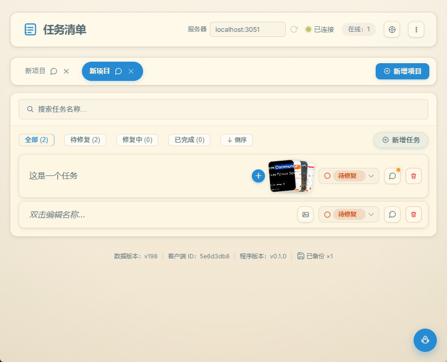
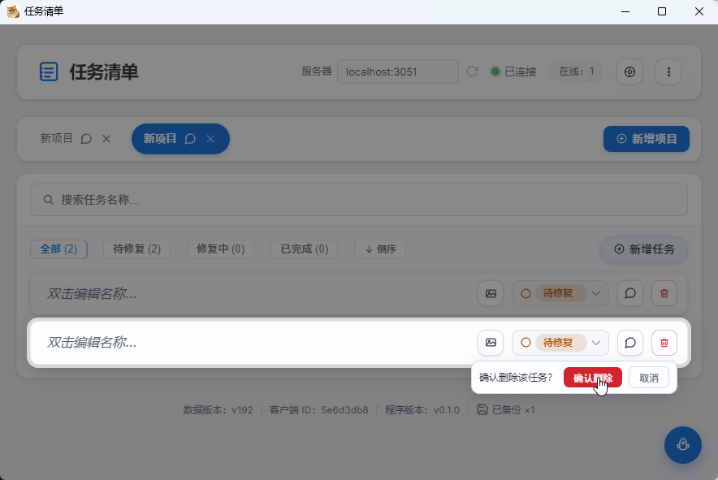
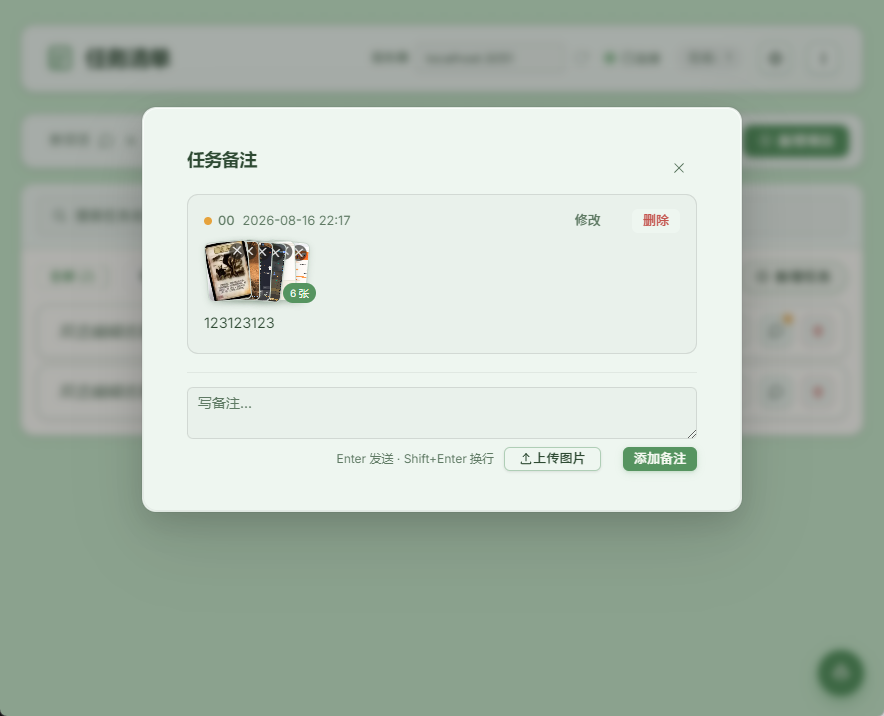

# 任务清单

<div align="center">


**局域网即开即用、数据自持的多人协作清单工具** —— 给 5 个人的小团队，一个有性格的"手账"。

[](https://opensource.org/licenses/MIT)


</div>

---

## ✨ 它有什么特别的

**没有账号、没有云、不需要配置服务器**——同事打开浏览器或双击 exe 就连上，数据存在你自己电脑里。

它不是大厂效率工具的"缩小版"，而是为小团队长出来的、有性格的工具：

| | |
|---|---|
| 🌙 **深夜会安慰你** | 晚上 8 点后推进任务状态，弹一句深夜语录——加班人的小确幸 |
| 🎨 **13 套主题，每套一套皮肤** | 暖纸面、星空蓝、黑客帝国……切换带暗色幕布，按钮阴影都跟着换 |
| 🤝 **负责人"划一下才知道"** | 谁建的任务谁负责，hover 才显示——不公示、不施压，小团队的默契 |
| ⏰ **deadline 不压首页** | 回车后评估"还要几天"，自动算好截止时间，借备注悄悄提醒 |
| 🔒 **数据自持** | 数据 + 图片全在你自己电脑，导出 / 导入 / 轮转备份 / 删除快照全套 |
| ⚡ **零配置上手** | `npm start` 或双击 exe，局域网地址自动打印，端口自动探测 |

## 🖼 长这样



主界面 · 暖纸面（默认主题）——项目标签 / 任务列表 / 状态 / 图片牌堆



删除任务：长按蓄怒 → 确认气泡 + 行聚光 + 渐隐幕布



双层备注：作者色点 + 只读默认 + 修改/删除

## 🚀 快速开始

```bash
npm install && npm start
# 浏览器打开 http://局域网IP:3050
```

- **Windows 便携版**：`npm run build` → `pack/任务清单.exe`，发给同事双击即用
- **桌面版**：`npm run electron`（托盘常驻、单实例、应用图标）

## 🧰 技术栈

Node.js · WebSocket · Vue 3 · Element Plus（离线本地化）· Electron

## 🛠 开发

继续开发维护请看 [DEVELOPMENT.md](DEVELOPMENT.md)（术语映射 / 目录地图 / 功能清单 / 架构与数据流 / 避坑索引 / 时间线）。

## 📄 License

[MIT](LICENSE) © 2026 HapyRain
